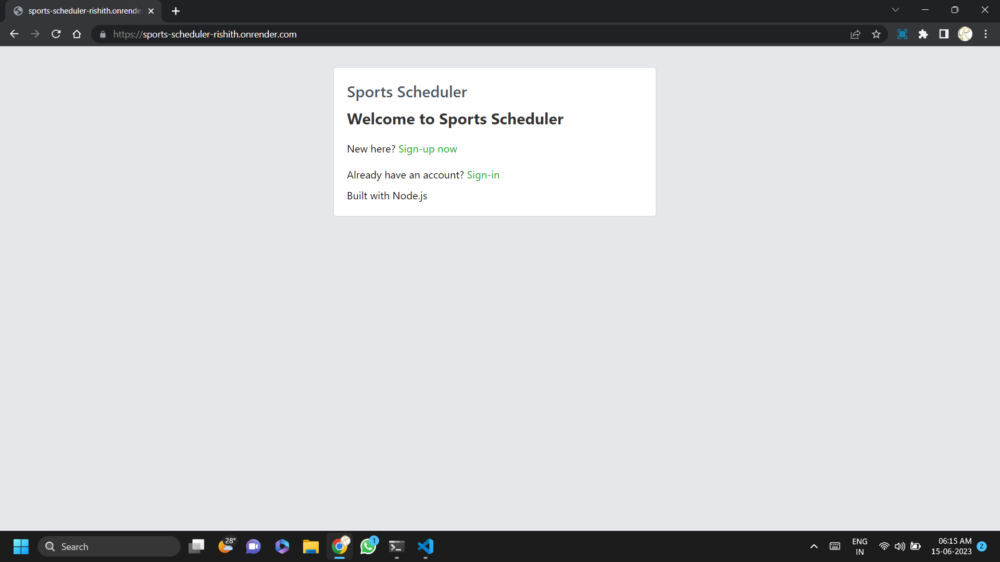

# Sports Scheduler

This is the final capstone project for AICTE Lite WD201 Pupilfirst.

[Website](https://sports-scheduler-rishith.onrender.com)
[Video](https://www.loom.com/share/5c5622f7cb544c19a15a71a0a4189806?sid=526bfcc1-6972-4e02-8942-005763d2fab2)

## Features

### Admin

- Admins has some extra features such as :

- - Creating a Sports
- - View the Reports of Sessions Created

### Players

- Players can create a session from the sports available
- Players can change their password.
- Leave a sessions

### Creator

- Sessions Creator can edit the sessions created.
- Add Players or Remove Players.
- Cancel the sessions created and give the reason if required.

### Screenshots

- 
- 
- 
- 
- 
- 
- 
- 
- 
- 
- 
- 
- 
- 
- 
- 

### Video Link

- https://www.loom.com/share/5c5622f7cb544c19a15a71a0a4189806?sid=526bfcc1-6972-4e02-8942-005763d2fab2